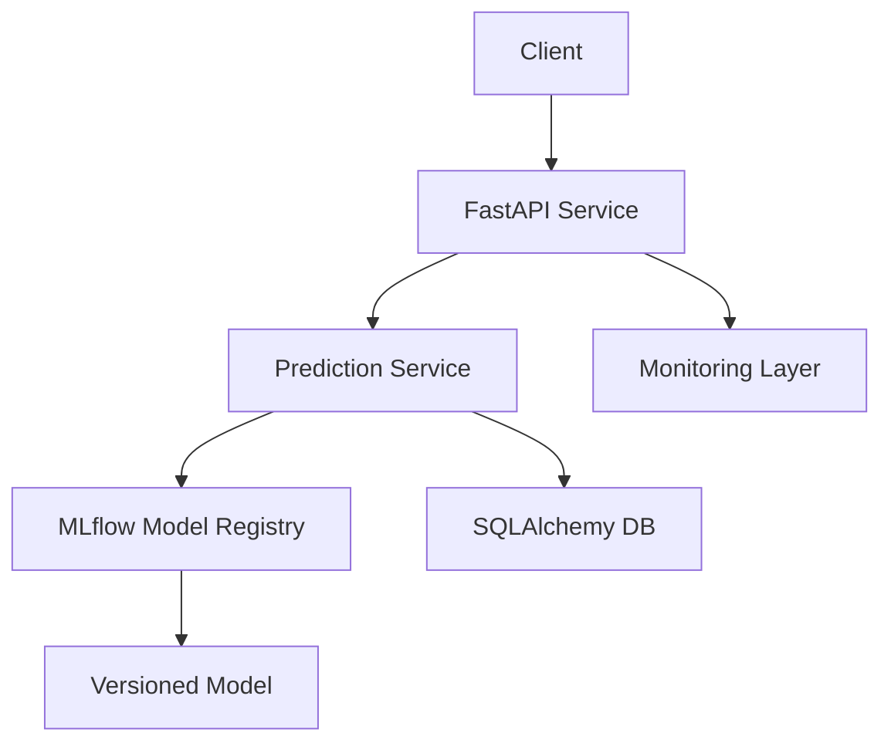

# 🚀 End-to-End ML System for Predicting Student Academic Performance

[](https://www.python.org/)
[](https://fastapi.tiangolo.com/)
[](https://mlflow.org/)
[]()
[]()

---

# 🧠 What This Project Demonstrates

This project analyzes how various socio-demographic and academic factors—such as gender, ethnicity, parental education level, lunch type, and test preparation—impact student performance as measured by test scores.

It focuses on the **engineering challenges of ML systems**, not just model accuracy:

* How do you **version and safely deploy models**?
* How do you **monitor system health and failures**?
* How do you ensure **reproducibility and traceability**?
* How do you design systems that **scale and evolve**?

👉 This project answers those questions with a working system.

---

# 🎯 Core Idea

Most ML projects:

* Train a model
* Expose a simple API
* Stop there

This project:

* Treats ML as a **long-lived production system**
* Implements **lifecycle management, observability, and reliability**

---

# 🏗️ System Architecture



---

# ⚙️ Key Engineering Decisions

## 1. 🔁 MLflow for Model Lifecycle Management

* Models are not hardcoded or file-based
* Loaded dynamically via:

  ```
  models:/my_model/v1
  ```

### Why this matters:

* Enables **safe deployment**
* Supports **rollback**
* Decouples training from serving

---

## 2. 🧱 Clean Architecture (Separation of Concerns)

| Layer      | Responsibility         |
| ---------- | ---------------------- |
| API        | Request handling       |
| Service    | Business logic         |
| Model      | Model loading (MLflow) |
| DB         | Persistence            |
| Monitoring | Metrics                |

### Why this matters:

* Easier to extend
* Easier to test
* Easier to scale

---

## 3. 📊 Built-in Observability

Tracks:

* Request count
* Failure rate
* Latency

### Why this matters:

> “If you can’t measure it, you can’t operate it.”

Production systems must be **observable**, not just functional.

---

## 4. 🧪 Reproducibility & Traceability

Each prediction logs:

* Input data
* Output prediction
* Model version

### Why this matters:

* Debugging production issues
* Auditing decisions
* Reproducing results

---

## 5. 🔐 Safe Model Execution

* Avoids unsafe `pickle`
* Uses MLflow-managed artifacts
* Validates input via schemas

### Why this matters:

* Prevents runtime failures
* Reduces security risks

---

## 6. ⚙️ Config-Driven System

* `.env`-based configuration
* No hardcoded values

### Why this matters:

* Environment portability
* Easier deployment

---

## 7. 🐳 Deployment-Ready

* Dockerized service
* `docker-compose` for orchestration
* CI pipeline for code quality

### Why this matters:

* Real-world deployment readiness
* Aligns with DevOps practices

---

# 🚀 How to Run

## 1. Start services

```bash
docker-compose up --build
```

## 2. Access API

* Docs → http://localhost:8000/docs
* Health → `/health`
* Metrics → `/metrics`
* Predict → `/predict`

---
